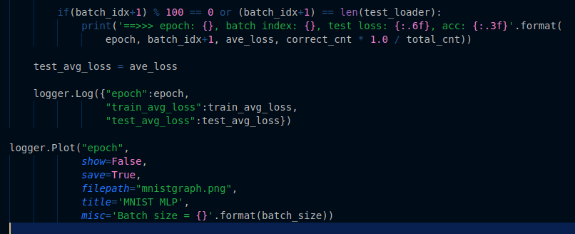

#Logger

This is a micro module for logging, tracking and visualizing the metrics/performances of machine learning models.

-> Very simple, sleek class for logging statistics.

-> Plot 2D line graphs using matplotlib in a single line.

